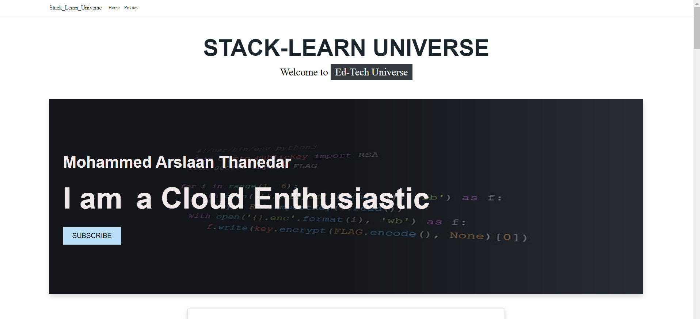
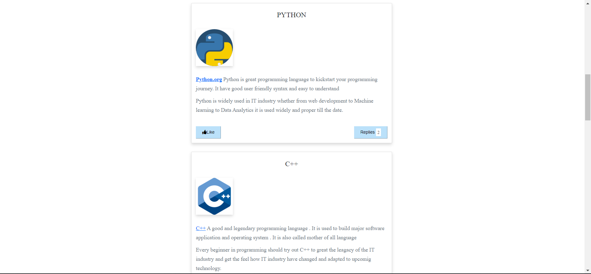
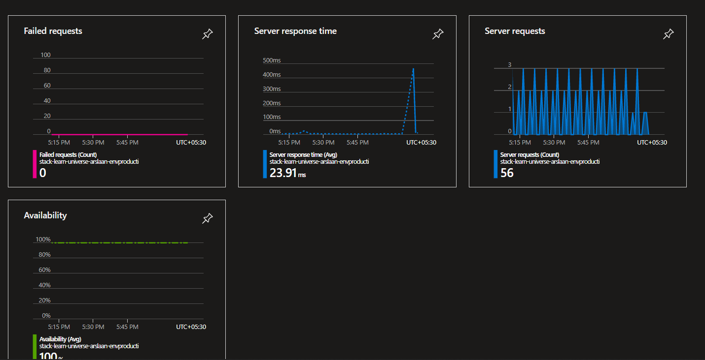
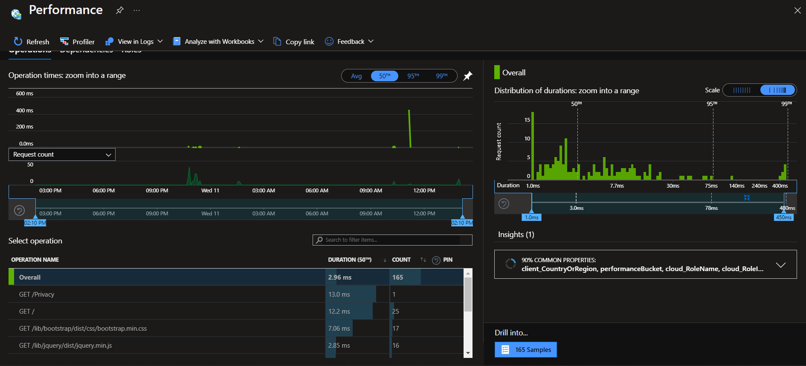
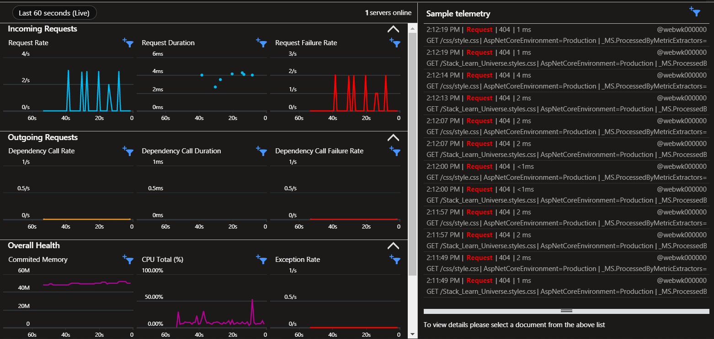
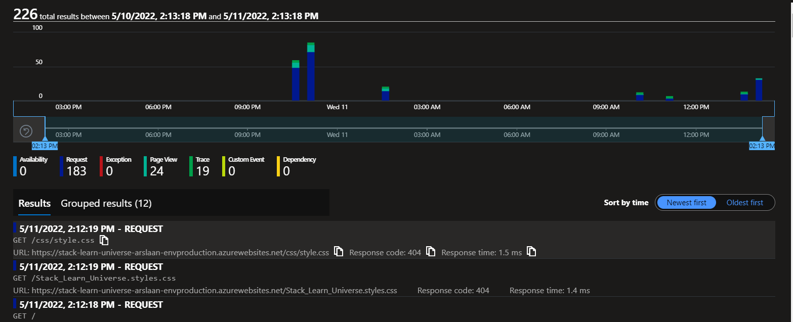
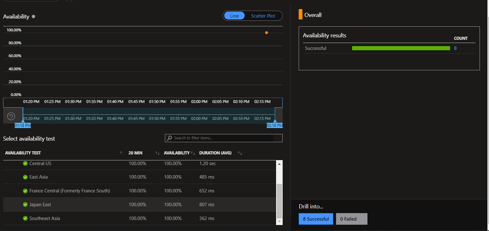
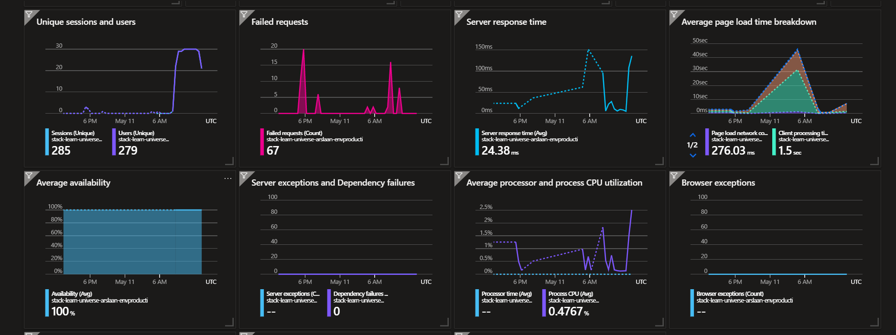

# Hi, I'm Arslaan! 👋
***
# Stack Learn Universe
***
The Stack Learn Universe is an website that interconnects multiple educational sites and
Provides a platform to access the most informative blogs and docs of Computer Science. It is basically designed for the begineers, to kickstart and boost their career
in IT Industry.


## Documentation
The Website is designed for Computer Science Aspirants to enhance leaning experience and provide a efficient learning roadmap.


| Modes         | Description                                                         |
| ----------------- | ------------------------------------------------------------------ |
|Deployment | Microsoft Azure : WebApps|
|Administration | Microsoft Azure : App service , Application Insights |
|Server Location|Central India|
| Server Backend | ASP.Net 6.0 |
| Backend | Javascript , C# |
|Frontend|HTML, CSS|


The Website is Hosted and Administered on Cloud Platform named Microsoft Azure and 
Web Server aligned with CI/CD pipeline to eleminate manual errors and provide faster delivery.


## Screenshots :
## Website -




#

# Microsoft Azure Server -

 ### Client Request Monitor : 

#

 ### Server Health :

#
 ### Live Metrics Monitor :

#

 ### Server Analytics :

#

 ### Load Balacer Test :

#

 ### Azure Administration Panel :

#

## Tech Stack

**Client:** C#, HTML, CSS, Javascript, ASP.Net 6.0 (LTS)

**Server:** Microsoft Azure : WebApp, App Service, Application Insights, Cloud Shell 


## 🧰 Languages and Tools:
<p align="center" >


## Setup and Run

To run tests, run the following command

```bash
    cd Stack Learn Universe Env.PROD
```
Setup dotnet application : 
```bash
    dotnet run --urls=https://localhost:5001/
```
Once dependencies are build close application and run :

```bash
    dotnet watch
```


